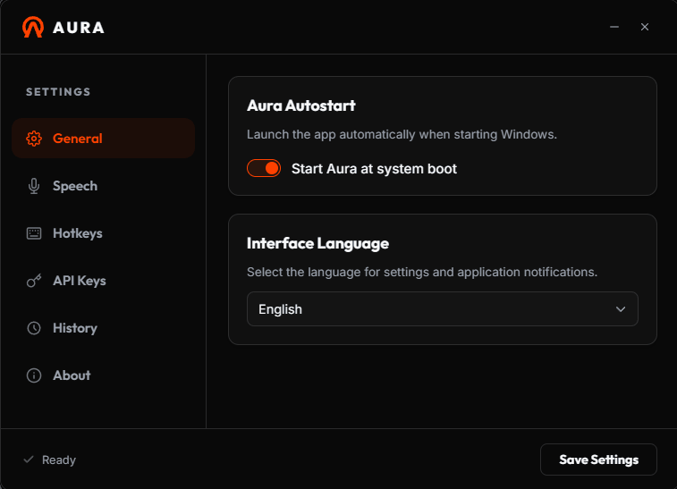

<p align="center">
  
</p>

<h1 align="center"><a href="https://aura-beryl-five.vercel.app/" style="text-decoration: none; color: inherit;">Aura — Voice Dictation for Windows</a></h1>
<p align="center">
  <a href="https://aura-beryl-five.vercel.app/"><b>🌐 Official Website: aura-beryl-five.vercel.app</b></a>
</p>

<p align="center">
  <a href="https://github.com/malashkadev/aura/actions/workflows/ci.yml"></a>
  <a href="LICENSE"></a>
  
  <a href="https://aura-beryl-five.vercel.app/"></a>
</p>

Hold a hotkey, speak, release — Aura transcribes your speech, cleans it up (punctuation, filler words) and types it into **any** Windows application. Works with cloud AI (Gemini / OpenAI / Groq) or fully offline with local Whisper / NVIDIA Parakeet.

Think of it as a **free, open-source alternative to Wispr Flow** — not just a transcriber, but a dictation *and editing* assistant: it polishes what you say and can even rewrite selected text on voice command.

**100% Free & Open Source** — Aura is completely free, with no ads, paid subscriptions, trial periods, or hidden limits.

> 🇷🇺 [Документация на русском](README.ru.md)

<p align="center">
  
  
</p>

## Features

- **Global hotkey dictation** — hold to talk, or short-tap to latch recording (toggle mode); `Esc` cancels.
- **Two engines**:
  - **Cloud** — Gemini, OpenAI (Whisper + GPT) or Groq (Whisper + Llama), with per-provider API keys.
  - **Local** — whisper.cpp sidecar or NVIDIA Parakeet (via sherpa-onnx), 100% offline and private; models downloaded from the settings UI.
- **AI cleanup** — removes filler words, fixes punctuation and grammar, never answers your questions — only transcribes them.
- **Live streaming mode** (experimental) — text appears as you speak and is replaced by the final version.
- **Transcription history** — the last 50 dictations with one-click copy.
- **Custom dictionary** — bias recognition towards your names and terms.
- **11 language options** — auto-detect, keyboard-layout detection, or a fixed language (ru, en, de, es, fr, it, zh, pt, tr).
- **Voice punctuation commands** (optional) — “comma”, “period”, “new line” → `,`, `.`, newline.
- **Polished overlay** — live waveform, recording timer, error states and optional sound themes (zen / rhodes / sci-fi / classic).
- **Quality of life** — autostart with Windows, tray icon, single-instance guard, focus guard (never types into the wrong window).

## How Aura compares

Aura sits between minimalist local transcribers and paid AI dictation tools. If you just want raw offline transcription, [Handy](https://handy.computer/) is excellent and cross-platform. Aura's focus is the **AI editing layer on top** — and it's free.

| | **Aura** | **Handy** | **Wispr Flow** |
|---|---|---|---|
| Price | Free & open source | Free & open source | Paid (subscription) |
| Platforms | Windows | Windows / macOS / Linux | Windows / macOS |
| Local engine (private) | ✅ Whisper / Parakeet | ✅ Whisper / Parakeet | ❌ cloud only |
| Cloud engine (no GPU needed) | ✅ Gemini / OpenAI / Groq | ❌ | ✅ |
| AI cleanup (filler removal, grammar) | ✅ | ➖ basic punctuation only | ✅ |
| Edit selected text by voice | ✅ | ❌ | ✅ |
| Voice punctuation commands | ✅ | ❌ | ➖ |
| Transcription history | ✅ | ❌ | ✅ |
| Custom dictionary | ✅ | ❌ | ✅ |

> Honest trade-offs: Aura is Windows-only for now, and its cloud mode sends audio to the provider you pick (local mode does not). Handy is more mature and cross-platform. Wispr Flow is the most polished but paid and cloud-only.

## Installation

Download the latest installer from [Releases](https://github.com/malashkadev/aura/releases) and run it. You can explore the interactive settings mockup and watch the live demo on our [Official Website](https://aura-beryl-five.vercel.app/).

For cloud mode you will need an API key — the free [Groq](https://console.groq.com/) tier works great. For local mode just download a Whisper or Parakeet model from the settings (base is a good start for Whisper).

> **First launch — "Windows protected your PC"?** The installer isn't code-signed yet (a certificate costs a few hundred dollars a year), so Windows SmartScreen shows a warning for new open-source apps. Click **More info → Run anyway**. The source is fully open if you'd rather build it yourself.

## Usage

| Action | Default |
|---|---|
| Start recording | hold `Alt+V` |
| Finish and paste | release the hotkey |
| Latch recording (toggle mode, optional) | short tap `Alt+V` |
| Cancel recording | `Esc` |

The hotkey, language, engine and everything else is configurable from the settings window (tray icon → "Open Settings").

## Building from source

Prerequisites: [Rust](https://rustup.rs/) (stable), [Node.js](https://nodejs.org/) 18+, WebView2 (preinstalled on Windows 11).

```bash
git clone https://github.com/malashkadev/aura.git
cd aura
npm install
npm run dev     # development
npm run build   # NSIS/MSI installer in src-tauri/target/release/bundle/
```

The whisper.cpp sidecar binaries ship in `src-tauri/binaries/`. To update them to a newer whisper.cpp release, run `python install_whisper.py`.

Run the test suite:

```bash
cd src-tauri
cargo test
```

## Privacy

- **Local mode** never sends anything anywhere — audio is processed on your machine.
- **Cloud mode** sends the recorded audio to the provider you chose. Nothing else is collected; there is no telemetry.
- Settings (including API keys) are stored locally in `%APPDATA%/com.aura.app/settings.json`; history in `%LOCALAPPDATA%/com.aura.app/history.json`. Note: API keys are stored in plain text (tested OS Credential Manager integration, but reverted it to stable local storage due to OS-specific service instability).

## Recently added

- **Parakeet local engine** — offline NVIDIA Parakeet TDT v3 via [sherpa-onnx](https://github.com/k2-fsa/sherpa-onnx), running as a resident WebSocket server so the model loads once and recognition takes under a second (vs. ~12 s for a cold CLI call). Notes: the custom dictionary isn't applied on this engine due to a model-level limitation (the NeMo transducer only supports greedy search, which is incompatible with hotwords in sherpa-onnx), and the built-in offline punctuation model covers English — Russian uses the voice-command punctuation instead.
- **Silero VAD** — replaces the old energy-based silence gate to trim pauses and cut silence hallucinations.
- **Signed auto-updates** — releases are signed and the app checks for and can install updates in-app.

## Roadmap

Planned, in rough priority order. Ideas and contributions are welcome — open an issue!

- **macOS support** — the native port (global hotkeys via `CGEventTap`, CoreAudio capture) now lives in the main codebase and **compiles in CI**. Still needs a macOS speech-recognition sidecar, `.app` bundling, the Accessibility-permission flow and testing on real hardware before it's usable.

## License

[AGPL-3.0](LICENSE)
