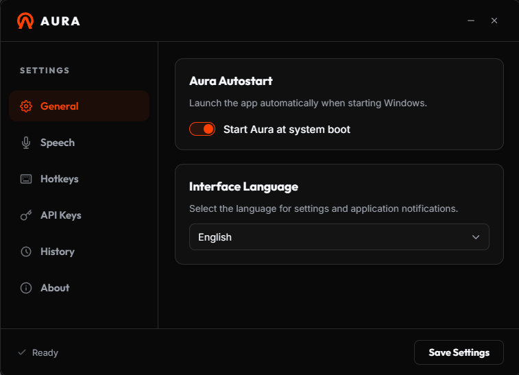

<p align="center">
  
</p>

<h1 align="center"><a href="https://aura-beryl-five.vercel.app/" style="text-decoration: none; color: inherit;">Aura — Voice Typing for Windows</a></h1>
<p align="center">
  <a href="https://aura-beryl-five.vercel.app/"><b>🌐 Official Website: aura-beryl-five.vercel.app</b></a>
</p>

<p align="center">
  <a href="https://github.com/malashkadev/aura/actions/workflows/ci.yml"></a>
  <a href="LICENSE"></a>
  
  <a href="https://aura-beryl-five.vercel.app/"></a>
</p>

Press and hold the hotkey, speak, and release — Aura instantly transcribes your speech and types the text right under your cursor in **any** Windows application. Works completely offline and privately using local AI models (Whisper, NVIDIA Parakeet with CUDA GPU acceleration) or via cloud providers (Gemini, Groq, OpenAI, Hugging Face, Custom API).

**100% Free & Open Source (AGPL-3.0)** — no subscriptions, paywalls, telemetry, or advertisements.

> 🇷🇺 [Документация на русском](README.ru.md)

<p align="center">
  
  
</p>

## Features

- **Global hotkey dictation** — hold to talk (`Alt+V`), or short-tap to latch recording (toggle mode); `Esc` cancels.
- **Two recognition modes**:
  - **Local (100% offline & private)** — whisper.cpp or NVIDIA Parakeet TDT v3 (sherpa-onnx) on CPU or NVIDIA CUDA GPU. Audio never leaves your computer; models are downloaded in a single click directly from settings.
  - **Cloud** — Google Gemini, Groq, OpenAI, Hugging Face, or your custom OpenAI-compatible server.
- **NVIDIA CUDA GPU acceleration** — hardware GPU acceleration for Whisper and Parakeet models with 1-click on-demand runtime downloading and automatic CPU fallback.
- **Real-time streaming input** — smooth word-level streaming into active fields without flickering or text duplicates.
- **Focus Guard & Context Editing** — ensures transcribed text is never typed into the wrong window if focus shifts (with safe clipboard handoff), and provides 1-click text editing on selected text with a visual AI sparkle indicator.
- **Audio device selection & tail hold** — choose physical microphone input device with intelligent 160ms post-release grace buffer and Silero VAD silence trimming so final words are never clipped.
- **Transcription history** — last 50 dictations with a live search bar, source filters (`All` / `Local` / `Cloud`), and one-click copy.
- **Custom dictionary** — bias recognition towards your names, brands, and technical terms.
- **11 language options** — auto-detect, keyboard-layout detection, or fixed selection (ru, en, de, es, fr, it, zh, pt, tr).
- **Polished overlay** — microphone VU meter, recording timer, sound themes (Zen, Rhodes, Sci-Fi, Classic), and display customization.
- **Quality of life & security** — autostart with Windows, system tray menu, Windows DPAPI credential encryption, and one-click diagnostic reports.

## How Aura compares

Aura combines the speed and privacy of local neural networks with the flexibility of cloud AI providers.

| Feature | **Aura** | **Handy** | **Wispr Flow** |
|---|---|---|---|
| **Price** | **Free (AGPL-3.0)** | Free (Open Source) | Paid (subscription) |
| **Platforms** | Windows *(macOS in progress)* | Windows / macOS / Linux | Windows / macOS |
| **Local Models (Offline)** | **✅ Whisper & Parakeet (CUDA GPU / CPU)** | ✅ Whisper / Parakeet | ❌ Cloud only |
| **Cloud Providers** | **✅ Gemini, Groq, OpenAI, HF, Custom** | ❌ | ✅ Proprietary cloud |
| **Real-time Streaming Input** | **✅** | ❌ | ✅ |
| **Focus Guard Protection** | **✅** | ❌ | ➖ |
| **Data Encryption (DPAPI)** | **✅** | ❌ | ➖ |
| **Custom Term Dictionary** | **✅** | ❌ | ✅ |
| **History with Search & Filters** | **✅** | ❌ | ✅ |

> Honest trade-offs: Official builds currently target Windows 10 & 11 (macOS port is compiling in CI). Handy is a mature cross-platform choice for raw offline dictation. Wispr Flow offers a polished UI, but operates strictly via a paid subscription and proprietary cloud.

## Installation

Download the installer from [Releases](https://github.com/malashkadev/aura/releases) and run it. You can explore the interactive settings mockup and live demo on our [Official Website](https://aura-beryl-five.vercel.app/).

For local mode, download a model from the "Speech" tab in Settings (the `Base` model is a great starting point for fast CPU inference). For cloud mode, provide an API key for your chosen provider (Groq and Google Gemini offer free tiers).

> **First launch — "Windows protected your PC"?** The installer is not signed with an expensive commercial Authenticode certificate yet, so Windows SmartScreen warns about new open-source binaries. Click **More info → Run anyway**. The codebase is fully open-source for independent audit and self-compilation.

## Usage

| Action | Default |
|---|---|
| Start recording | hold `Alt + V` |
| Finish and type text | release the hotkey |
| Latch recording (toggle mode) | short tap `Alt + V` |
| Cancel recording | `Esc` |

The hotkey, language, recognition engine, and overlay settings are configurable via Settings (tray icon → "Open Settings").

## Building from source

Prerequisites: [Rust](https://rustup.rs/) (stable), [Node.js](https://nodejs.org/) 18+, WebView2 (preinstalled on Windows 10/11).

```bash
git clone https://github.com/malashkadev/aura.git
cd aura
npm install
npm run dev     # development mode
npm run build   # NSIS/MSI installer in src-tauri/target/release/bundle/
```

Whisper.cpp sidecar binaries live in `src-tauri/binaries/`. To update them to a newer release, run `python install_whisper.py`.

Run test suite:

```bash
cd src-tauri
cargo test
```

## Privacy & Security

- **Local mode** runs entirely offline on your machine (CPU / GPU) and never transmits audio over the network.
- **Cloud mode** sends audio recordings, generated transcripts, selected text (only when selection editing is active), and custom dictionary terms directly to your chosen provider over TLS with zero telemetry.
- **Secure local storage** — API keys and transcription history are encrypted using **Windows DPAPI** (`CryptProtectData`) with file access restricted to the current user and SYSTEM via ACL.
- **Update checks** run only on demand or when explicitly enabled in settings.

## Recently added

- **NVIDIA CUDA GPU Acceleration** — offload local Parakeet model inference to NVIDIA GPUs with on-demand runtime downloading and auto CPU fallback. CUDA setup reuses a complete CUDA 11/cuDNN 8 runtime available through `PATH`; otherwise it downloads pinned private copies. Setup downloads up to 1.52 GiB of archives and installs up to 2.33 GiB of runtime files, including proprietary NVIDIA components covered by the terms in [THIRD_PARTY_NOTICES.md](THIRD_PARTY_NOTICES.md).
- **Audio Device Selection & VU Meter** — select physical microphone devices directly in Settings with a real-time input level meter and Silero VAD detection.
- **Post-Release Audio Grace Buffer (Tail Hold)** — 160ms tail buffer and expanded VAD margin to completely prevent trailing word and syllable clipping.
- **Context Editing & Safe Clipboard Handoff** — AI sparkle indicator for selection editing; if target window focus shifts during transcription, text is safely copied to the clipboard with an overlay notification.
- **Google Gemini 3.6 Flash Integration** — upgraded cloud provider integration to multimodal Gemini 3.6 Flash for instant recognition and voice editing.
- **Overlay Display Customization & Topmost Guard** — toggle timer and status messages to show a minimal acoustic wave capsule, with `HWND_TOPMOST` z-order protection against fullscreen apps.
- **Instant Overlay Dismissal** — eliminated visual lag by triggering chime and overlay hide immediately upon text insertion.

## Roadmap

- **macOS support** — native port (global hotkeys via `CGEventTap`, CoreAudio capture) is in the codebase and **compiles in CI**. Remaining items: macOS whisper binary, `.app` bundle, Accessibility-permission flow, and hardware testing.

## License

[AGPL-3.0](LICENSE)
